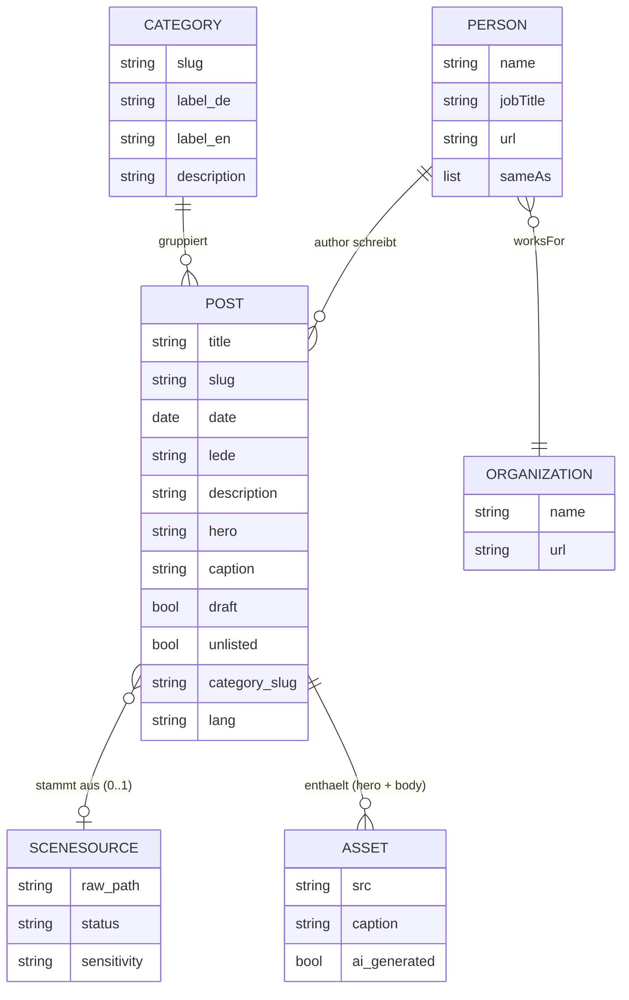
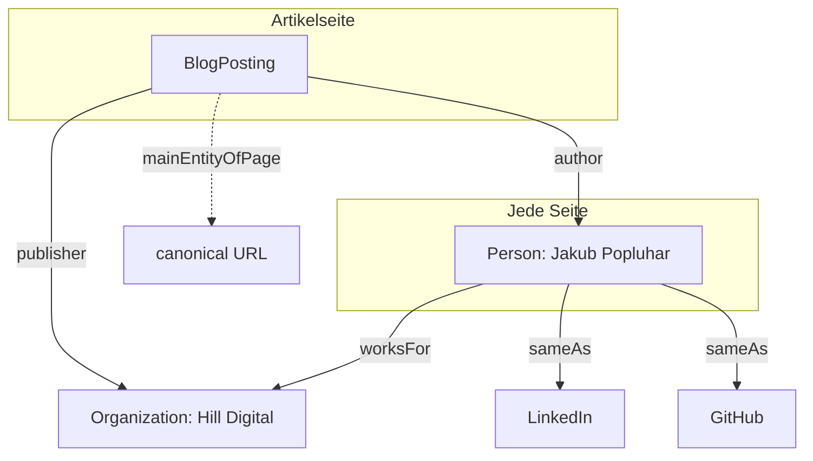
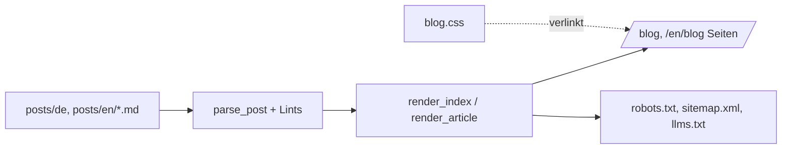

# Blog Architecture

Datenmodell und Entity-Graph des Blogs. Referenz für Build (`build.py`) und Erweiterungen. Siehe `CLAUDE.md` fuer den Prozess.

Created: 2026-07-05

## 1. Datenmodell (Entity-Relationship)

Jeder Artikel ist eine Markdown-Datei mit Frontmatter. Beziehungen im Content-Modell:

Regeln:
- Ein Post hat genau 1 Kategorie (Phase 3), genau 1 Author, 0 bis 1 SceneSource, 0 bis n Assets.
- `unlisted` (Dateiname mit `_`): immer gebaut, nie gelistet, nicht in Sitemap.
- `draft: true`: nur mit `--drafts` gebaut, nie gelistet.
- SceneSource ist die Herkunft aus der Content-Pipeline (raw Scene / seed). Nicht im HTML sichtbar, nur redaktionelle Spur.

## 2. GEO-Entity-Graph (JSON-LD, was im HTML landet)

Was der Build als `application/ld+json` pro Seite ausgibt (GEO Gate 1: Entity-Konsistenz):

- **Person** (global, auf jeder Blogseite): Name, jobTitle "Business Lead bei Hill Digital & KI-Trainer", worksFor Hill Digital, sameAs LinkedIn + GitHub, image Headshot. Definiert in `build.py` als `PERSON`.
- **BlogPosting** (nur Artikel): headline, datePublished/dateModified, description, image, author (Person), publisher (Organization), mainEntityOfPage (canonical), inLanguage.
- **BreadcrumbList** kommt in Phase 3 dazu (sobald Kategorieseiten existieren): Blog zu Kategorie zu Artikel.

## 3. Build-Fluss

Lints (nicht fatal, am Ende ausgegeben): fehlende `description`, em/en-Dash im Body, H-Sprung.

## 4. Erweiterungspunkte
- **Kategorien (Phase 3):** `CATEGORIES`-Config in `build.py`, `render_category`, Cluster im Index, BreadcrumbList-JSON-LD.
- **EN-Mirror (Phase 4):** EN-Posts + English-Entity-Bridge (Wikidata Q-ID in `sameAs`).
- **Kommentare (Phase 4):** Giscus-Snippet im Artikel-Template.
